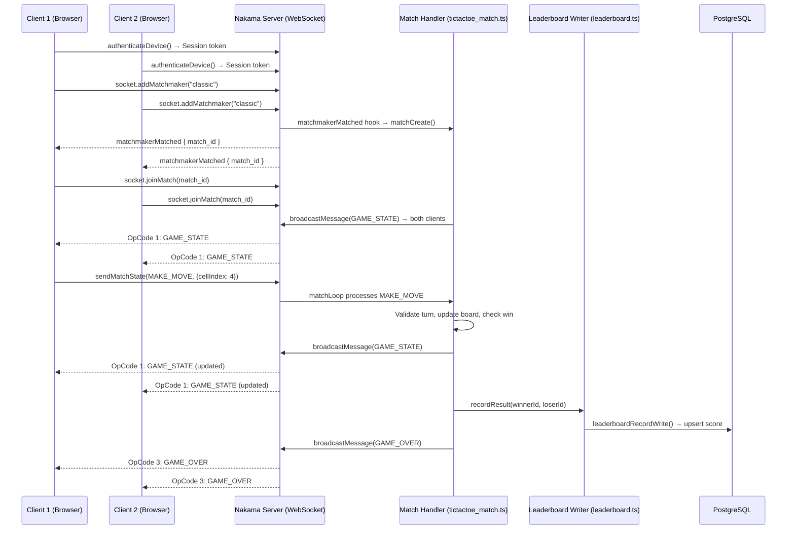
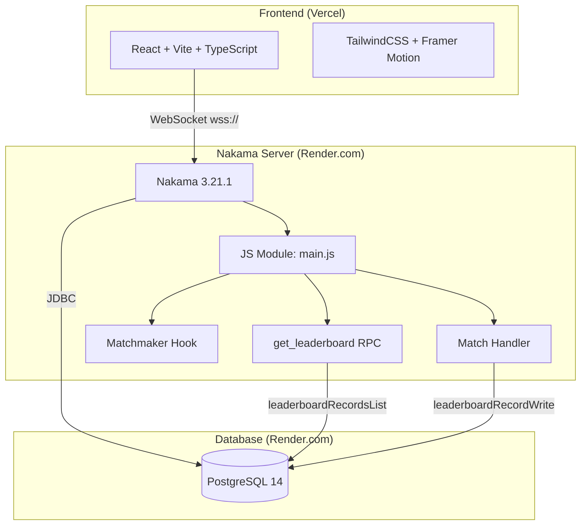

# TicTacToe PvP — Full-Stack Multiplayer Game

> **Assignment submission for LILA** — A production-ready server-authoritative real-time Tic-Tac-Toe game built with Nakama + React.

[](https://render.com)

---

## Overview

A fully-featured competitive Tic-Tac-Toe game with:

- **Real-time multiplayer** via Nakama WebSocket (no polling)
- **Server-authoritative** — all game logic runs server-side; clients cannot cheat
- **Automatic matchmaking** — queue for a game, get paired instantly
- **Two game modes** — Classic (no time limit) and Timed (30s/move or forfeit)
- **Global leaderboard** — wins, losses, win streak, score persisted in Postgres
- **Reconnect grace period** — 15 seconds for a player to reconnect before forfeit
- **Dark gaming aesthetic** — neon cyan/purple, glowing board cells, smooth animations

---

## Architecture

### Data Flow



### System Architecture



### Tech Stack

| Layer | Technology |
|-------|-----------|
| Frontend | React 18, TypeScript, Vite, TailwindCSS 3, Framer Motion |
| Realtime | Nakama JS SDK (@heroiclabs/nakama-js) WebSocket |
| Backend | Nakama 3.21.1 (self-hosted), TypeScript → esbuild → JS |
| Database | PostgreSQL 14 (Render free managed) |
| Hosting | Render.com (Nakama) + Vercel (Frontend) — 100% free |

---

## Project Structure

```
TicTacToe_Lila/
├── frontend/
│   ├── index.html
│   ├── package.json
│   ├── vite.config.ts
│   ├── tailwind.config.js
│   ├── postcss.config.js
│   ├── tsconfig.json
│   ├── tsconfig.node.json
│   └── src/
│       ├── App.tsx                     ← State machine router
│       ├── main.tsx
│       ├── index.css                   ← Tailwind + custom glow/anim CSS
│       ├── lib/
│       │   └── nakamaClient.ts         ← Singleton client + auth helpers
│       ├── hooks/
│       │   ├── useNakama.ts            ← Auth + socket lifecycle
│       │   ├── useGame.ts              ← Match lifecycle + game state
│       │   └── useLeaderboard.ts       ← RPC leaderboard fetch
│       └── components/
│           ├── NicknameModal.tsx
│           ├── HomeScreen.tsx          ← Two mode buttons (no ModeSelector)
│           ├── Matchmaking.tsx
│           ├── Board.tsx               ← 3×3 grid with glow/win animations
│           ├── Timer.tsx               ← SVG circular countdown
│           ├── GameRoom.tsx            ← Composes game screen
│           └── Leaderboard.tsx
├── nakama/
│   ├── package.json
│   ├── tsconfig.json
│   ├── build.js                        ← esbuild: platform:neutral, target:es2019
│   ├── local.yml                       ← Nakama server config
│   └── src/
│       ├── main.ts                     ← InitModule entry point
│       ├── types.ts                    ← Shared interfaces + OpCodes
│       ├── tictactoe_match.ts          ← Full match handler
│       ├── matchmaker.ts               ← matchmakerMatched hook
│       └── leaderboard.ts              ← createLeaderboard, RPC, recordResult
├── docker-compose.yml                  ← Local dev: Postgres + Nakama
├── Dockerfile                          ← Render.com deployment image
├── render.yaml                         ← Render.com Blueprint IaC
└── README.md
```

---

## Op Code Reference

| Code | Direction | Payload | Description |
|------|-----------|---------|-------------|
| `1` | Server → Clients | `GameStatePayload` | Full authoritative game state |
| `2` | Client → Server | `{ cellIndex: number }` | Player makes a move |
| `3` | Server → Clients | `GameOverPayload` | Game ended (win/draw/timeout/disconnect) |
| `4` | Client → Server | `{ mode: "classic" \| "timed" }` | Player ready signal |
| `5` | Server → Clients | `{ secondsRemaining, currentTurn }` | Timer tick (timed mode only) |
| `6` | Server → Clients | `{ disconnectedUserId, gracePeriodSeconds }` | Opponent disconnected |

---

## Local Development Setup

### Prerequisites

- Node.js 20+
- Docker + Docker Compose
- Git

### 1. Clone and install

```bash
git clone <your-repo-url>
cd TicTacToe_Lila

# Install Nakama module dependencies
cd nakama && npm install
cd ..

# Install frontend dependencies
cd frontend && npm install
cd ..
```

### 2. Build the Nakama module

```bash
cd nakama
node build.js
# → dist/main.js created
cd ..
```

### 3. Start local Nakama + Postgres

```bash
docker-compose up -d
```

Wait ~20 seconds for Nakama to boot. Verify:

```bash
docker-compose logs nakama | grep "startup done"
# Or check: curl http://localhost:7350/healthcheck
```

Nakama console: [http://localhost:7351](http://localhost:7351) — `admin / password`

### 4. Start the frontend

```bash
cd frontend
npm run dev
# → http://localhost:5173
```

> **Note:** Local dev connects to `localhost:7350` with no SSL by default. No env vars needed for local.

### 5. TypeCheck (optional, no build needed)

```bash
# Nakama module
cd nakama && npx tsc --noEmit

# Frontend
cd frontend && npx tsc --noEmit
```

---

## Testing Multiplayer Locally

Open **two browser tabs** at `http://localhost:5173`:

1. **Tab 1**: Enter nickname `Player1` → Click **Quick Match**
2. **Tab 2**: Enter nickname `Player2` → Click **Quick Match**
   - Both tabs should see "Finding opponent…" then transition to the game board
3. Take turns clicking cells — only the active player's cells are clickable
4. Complete a game — verify win detection, announce overlay, and leaderboard update
5. Click **View Leaderboard** to confirm scores persisted in Postgres

**Testing Timed Mode:**
1. Both tabs click **Timed Match**
2. Watch the SVG ring countdown. If a player doesn't move in 30s, they forfeit and the opponent wins

**Testing Reconnect Grace:**
1. Mid-game, close one tab
2. Remaining tab shows "Opponent disconnected — waiting 15s for reconnection…"
3. After 15 seconds, the remaining player wins by forfeit

---

## Deployment

### Render.com (Nakama Backend)

> **⚠️ IMPORTANT: Render free-tier PostgreSQL expires after 90 days.**  
> You will receive a warning email ~7 days before. To renew: go to Render Dashboard → your database → click **Extend** (or delete and recreate it, then update the `DATABASE_URL` env var in the Nakama service).

#### Step-by-step:

1. **Build the module first** (on your local machine or CI):
   ```bash
   cd nakama && npm install && node build.js
   ```
   Commit `nakama/dist/main.js` to your repository (or build in CI before Docker build).

2. **Push to GitHub**

3. **Connect Render.com:**
   - Go to [render.com](https://render.com) → New → **Blueprint**
   - Select your repo — Render auto-detects `render.yaml`
   - Click **Apply**

4. Render will create:
   - `nakama-db` — free managed PostgreSQL
   - `nakama-tictactoe` — Docker web service

5. **Set environment variables** in Render Dashboard → `nakama-tictactoe` → Environment:
   - `DATABASE_URL` — auto-wired from the database (already in render.yaml)

6. **Get your Nakama URL**: `https://nakama-tictactoe-y24p.onrender.com`

7. **Test**: visit `https://nakama-tictactoe-y24p.onrender.com/healthcheck` — should return `{}`

> Note: Free Render services **spin down** after 15 minutes of inactivity. The first request after spin-down takes ~30–60s to cold start. For the demo, open the URL manually before testing.

---

### Vercel (Frontend)

1. Push the repo to GitHub

2. Go to [vercel.com](https://vercel.com) → New Project → Import your repo

3. Configure:
   - **Root Directory**: `frontend`
   - **Build Command**: `npm run build`
   - **Output Directory**: `dist`

4. **Environment Variables** (Settings → Environment Variables):

   | Variable | Value |
   |----------|-------|
   | `VITE_NAKAMA_HOST` | `nakama-tictactoe-y24p.onrender.com` (no `https://`) |
   | `VITE_NAKAMA_PORT` | `443` |
   | `VITE_NAKAMA_USE_SSL` | `true` |

5. Click **Deploy** → your frontend is live at `https://tic-tac-toe-lila.vercel.app`

6. Open two incognito tabs at your Vercel URL and test a full multiplayer game.

---

## Leaderboard Scoring

| Event | Score Change | Wins | Losses | Streak |
|-------|-------------|------|--------|--------|
| Win (normal/timeout/forfeit) | +3 | +1 | — | +1 |
| Loss | +0 | — | +1 | Reset to 0 |
| Draw | +0 | — | — | Reset to 0 |

Scores are **cumulative** (Nakama `incr` operator) and sorted descending.

---

## Key Design Decisions

### Why Nakama?
Nakama provides built-in authoritative match handlers, a matchmaker, leaderboard APIs backed by Postgres, and a WebSocket layer — replacing what would otherwise be custom Socket.io + game loop infrastructure. Its TypeScript runtime lets server logic be type-safe.

### Why `platform: 'neutral'` in esbuild?
Nakama's Goja runtime is not Node.js — it doesn't have `process`, `Buffer`, or other Node globals. `platform: 'neutral'` prevents esbuild from injecting Node-only polyfills that would crash the Goja runtime.

### Why device-ID authentication (not email/password)?
For a demo/game context, frictionless anonymous auth is ideal. Each browser gets a stable UUID stored in localStorage — same account on every revisit without a sign-up flow.

### Reconnect Grace Period (15 seconds)
Rather than immediately forfeiting a player who loses network, the server waits 150 ticks (15s at tick-rate 10) during which the match pauses. This handles mobile network flaps and accidental tab closes without penalizing players unfairly.

### Server-Authoritative Move Validation
Every `MAKE_MOVE` is validated server-side:
1. Is it the sender's turn?
2. Is the target cell empty?
3. Is the cell index 0–8?

Clients that send invalid moves get silently ignored — no client-side trust.

---

## License

MIT — built as a technical assignment demonstration.
